## 安装
本工具是采用Unity的[包](https://docs.unity3d.com/cn/2019.4/Manual/PackagesList.html)形式，可以通过*Unity Package Manager*直接安装

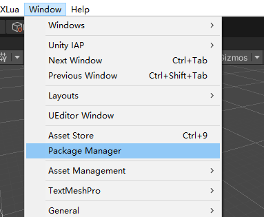

这里介绍两种常用方式
* 打开*Package Manager*窗口后，单击状态栏左侧的`+`按钮，选择`Add package from git URL`，然后在文本框中输入本工具的git地址`https://github.com/iwiniwin/unity-remote-file-explorer.git`，单击`Add`按钮后完成安装

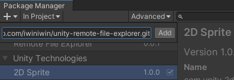

* 或直接克隆本工具到项目的`Pacages`目录下

更多将本工具作为包的安装方式可查看[Unity官方文档](https://docs.unity3d.com/cn/2019.4/Manual/upm-ui-actions.html)

## 使用
安装本工具后，可通过`Window > Analysis > Remote File Explorer`打开本工具窗口，将自动启动服务器

给项目的任意游戏对象添加`FileExplorerClient`组件

* 如果是固定连接到某台机器上，可直接通过Inspector面板在`Host`域输入这台机器的IP地址，然后勾选`Connect Automatically`，则会在应用启动时自动连接
* 如果希望应用启动后能主动选择连接到哪台机器，则可在Debug模式下封装一套简单的UI，使开发人员能够输入想要连接到的IP地址。例如在自己的菜单中添加一个条目或按钮，点击后弹出输入窗口。在成功获取到的IP地址后，将其赋值给`FileExplorerClient`组件的`Host`属性，然后调用`FileExplorerClient`组件的`StartConnect`方法开启连接

> 注意在启动连接前，请通过`Window > Analysis > Remote File Explorer`打开本工具窗口，否则将无法连接

通过本工具的`Status`面板可以查看到当前机器的IP地址

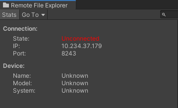

当连接成功后，本工具标题栏的Icon会变成绿色，以表示连接状态是已连接

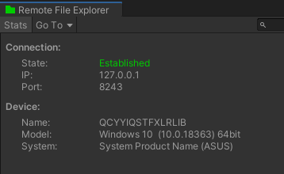

## 功能介绍
* 通过状态栏的`GOTO`可直接跳转到Unity预定义的一些路径

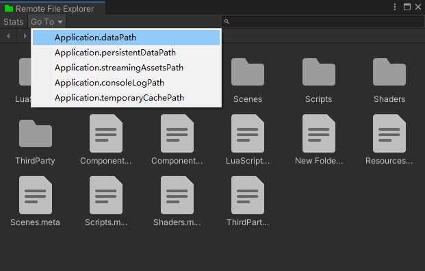

* 通过单击路径栏可打开输入框，以直接输入路径跳转或复制当前路径

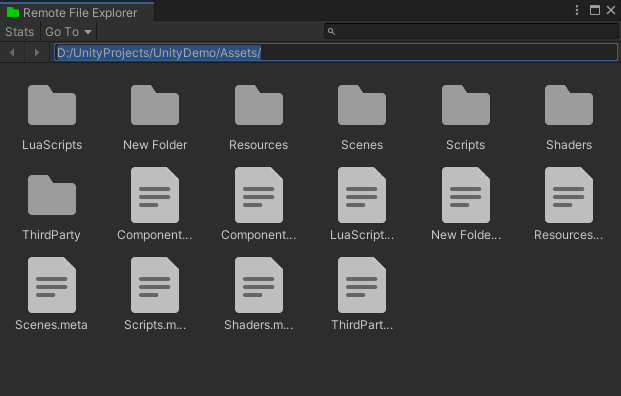

* 右键所选中的文件夹或文件支持下载

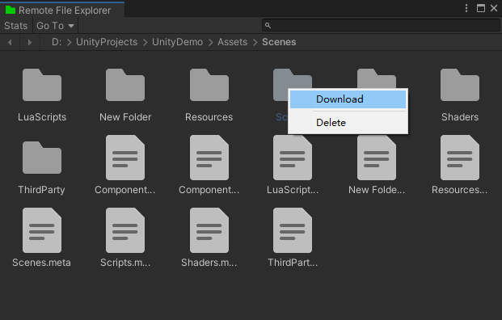

* 右键所选中的文件夹或文件支持删除

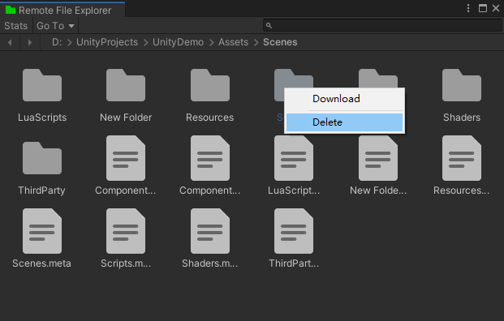

* 右键空白区域支持上传文件夹或文件

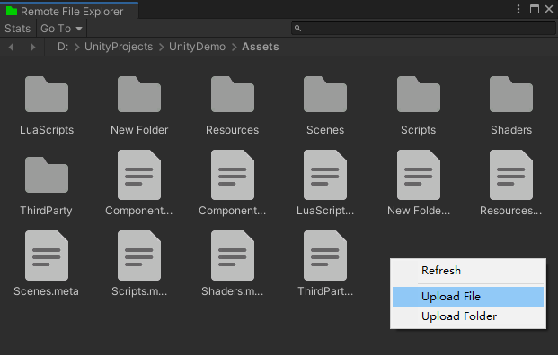

* 右键空白区域支持刷新当前路径的内容

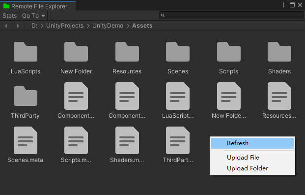

* 支持直接从`Unity Project`窗口拖拽文件夹或文件到本工具上传

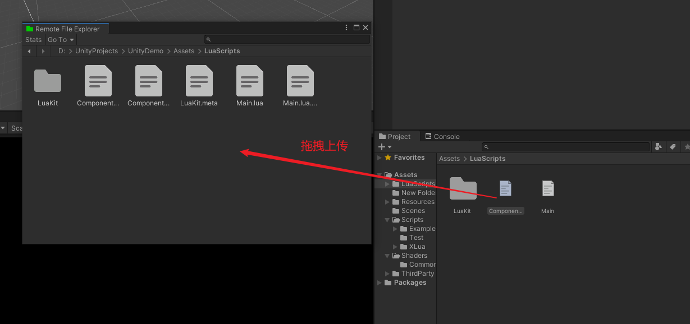

* 支持直接从系统文件浏览器拖拽文件夹或文件到本工具上传

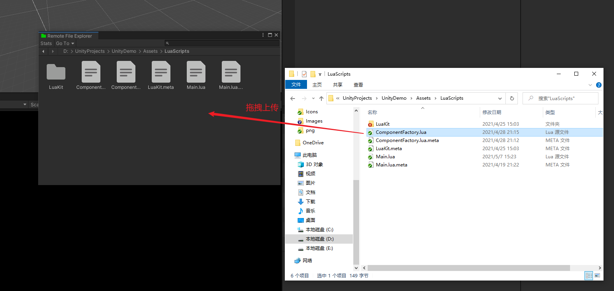

* 通过本工具`status`面板可查看连接状态以及已连接设备的信息，可用于辨别连接的是哪台设备

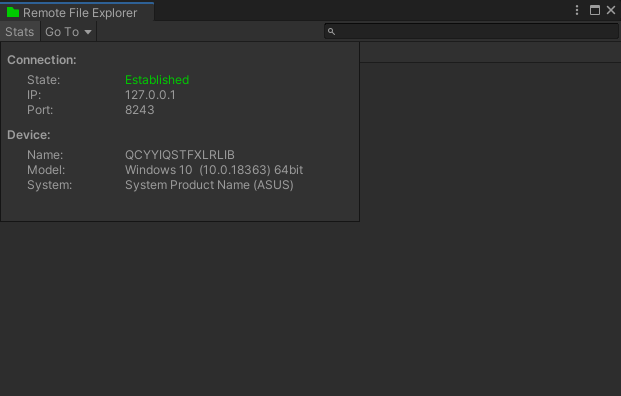

