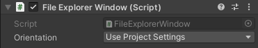

# Remote File Explorer

[Remote File Explorer](https://github.com/iwiniwin/unity-remote-file-explorer)是一个跨平台的**远程文件浏览器**，用户通过Unity Editor就能操作运行在手机上的游戏或是应用的的目录文件。比如当项目打包运行到设备上时，可通过[Remote File Explorer](https://github.com/iwiniwin/unity-remote-file-explorer)直接浏览设备上的目录文件，并进行下载，上传，删除等操作。尤其是Unity+Lua开发环境下的调试利器，当然，这里的调试不是指代码的逐行调试，而是泛指定位排查问题

## 用武之地
在很多场景下利用Remote File Explorer都可以极大的提高开发调试效率。例如：
* 应用真机上运行时出现异常情况，推测可能是关键资源丢失导致。此时可以通过本工具直接浏览手机上的相关文件，查看关键资源是否存在
* 通过本工具直接拉取手机上的日志文件或内存分析文件等各类文件，从此告别数据线
* **如果项目采用了XLua或SLua开发，在真机开发调试时，可通过本工具直接上传修改后的Lua代码，重启应用即可生效。从而避免每修改一次代码就重新构建一次应用的繁琐过程，大大提高调试效率**

更详细的用例演示可以查看[这篇博文](https://www.cnblogs.com/iwiniwin/p/15595243.html)，演示Demo工程可以查看[这里](https://github.com/iwiniwin/RemoteFileExplorerDemo)

## 安装
本工具是采用Unity的[包](https://docs.unity3d.com/cn/2019.4/Manual/PackagesList.html)形式，可以通过*Unity Package Manager*直接安装

这里介绍两种常用方式
* 打开"Window > Package Manager"窗口后，单击状态栏左侧的"+"按钮，选择"Add package from git URL"，然后在文本框中输入本工具的git地址`https://github.com/iwiniwin/unity-remote-file-explorer.git`，单击"Add"按钮后完成安装
* 或直接克隆本工具到项目的"Packages"目录下

详细安装方式可以查看[使用文档](Documentation~/RemoteFileExplorer.md)，更多将本工具作为包进行安装的方式可查看[Unity官方文档](https://docs.unity3d.com/cn/2019.4/Manual/upm-ui-actions.html)

## 使用
安装本工具后，可通过"Window > Analysis > Remote File Explorer"打开本工具窗口，将自动启动服务器

给项目的任意游戏对象添加*FileExplorerClient*组件

如果是固定连接到某台机器上，可直接通过Inspector面板在"Host"域输入这台机器的IP地址，然后勾选"Connect Automatically"，则会在应用启动时自动连接

如果希望应用启动后能主动选择连接到哪台机器，则可在Debug模式下封装一套简单的UI，使开发人员能够输入想要连接到的IP地址。例如在自己的菜单中添加一个条目或按钮，点击后弹出输入窗口。在成功获取到的IP地址后，将其赋值给FileExplorerClient组件的"Host"属性，然后调用FileExplorerClient组件的"StartConnect"方法开启连接

也可以使用本工具自带的一个简易UI，给项目的任意游戏对象添加*FileExplorerWindow*组件（此时不用再额外添加*FileExplorerClient*组件）

## 功能
详细的图文功能介绍请查看[使用文档](Documentation~/RemoteFileExplorer.md)
* 通过状态栏的"GOTO"可直接跳转到Unity预定义的一些路径
* 通过单击路径栏可打开输入框，以直接输入路径跳转或复制当前路径
* 右键所选中的文件夹或文件支持下载
* 右键所选中的文件夹或文件支持删除
* 右键空白区域支持上传文件夹或文件
* 右键空白区域支持刷新当前路径的内容
* 支持直接从Unity Project窗口拖拽文件夹或文件到本工具上传
* 支持直接从系统文件浏览器拖拽文件夹或文件到本工具上传
* 通过本工具"status"面板可查看连接状态以及已连接设备的信息，可用于辨别连接的是哪台设备
* 通过配置[BeforeUploadAttribute](https://github.com/iwiniwin/unity-remote-file-explorer/blob/main/Editor/Utilities/BeforeUploadAttribute.cs)自定义上传时的额外操作，例如上传lua代码时自动加密
* 通过配置[CustomMenuAttribute](https://github.com/iwiniwin/unity-remote-file-explorer/blob/main/Editor/Utilities/CustomMenuAttribute.cs)自定义操作菜单
