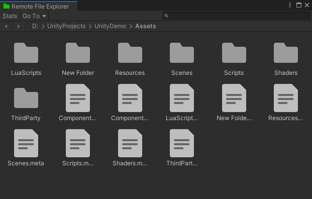
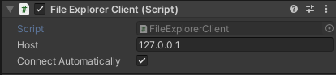

# Remote File Explorer

[Remote File Explorer](https://github.com/iwiniwin/unity-remote-file-explorer)是一个跨平台的远程文件浏览器，使用户通过*Unity Editor*就能操作应用所运行平台上的目录文件。比如当项目打包运行到设备上时，可通过[Remote File Explorer](https://github.com/iwiniwin/unity-remote-file-explorer)直接浏览设备上的目录文件，并进行下载，上传，删除等操作。

## 用武之地
在很多场景下利用本工具都可以极大的提高开发调试效率。例如：
* 应用打包后在真机上运行时，出现经推测可能是资源丢失导致的异常情况。此时可以通过本工具直接浏览手机上的相关文件，查看关键资源是否存在
* 应用的某个版本在真机上运行时出现bug，而在开发环境无法复现时，可通过本工具直接下载真机上运行的代码，定位差异
* **如果项目采用了XLua或SLua开发，在真机开发调试时，可通过本工具直接上传修改后的Lua代码，然后重启应用即可生效。从而避免每修改一次代码就重新构建一次应用的繁琐过程，大大提高调试效率**

## 安装
本工具是采用Unity的[包](https://docs.unity3d.com/cn/2019.4/Manual/PackagesList.html)形式，可以通过*Unity Package Manager*直接安装

这里介绍两种常用方式
* 打开*Package Manager*窗口后，单击状态栏左侧的`+`按钮，选择`Add package from git URL`，然后在文本框中输入本工具的git地址`https://github.com/iwiniwin/unity-remote-file-explorer.git`，单击`Add`按钮后完成安装
* 或直接克隆本工具到项目的`Pacages`目录下

详细安装方式可以查看[使用文档](Documentation~/RemoteFileExplorer.md)，更多将本工具作为包的安装方式可查看[Unity官方文档](https://docs.unity3d.com/cn/2019.4/Manual/upm-ui-actions.html)

## 使用
安装本工具后，可通过`Window > Analysis > Remote File Explorer`打开本工具窗口，将自动启动服务器

给项目的任意游戏对象添加`FileExplorerClient`组件

如果是固定连接到某台机器上，可直接通过Inspector面板在`Host`域输入这台机器的IP地址，然后勾选`Connect Automatically`，则会在应用启动时自动连接

如果希望应用启动后能主动选择连接到哪台机器，则可在Debug模式下封装一套简单的UI，使开发人员能够输入想要连接到的IP地址。例如在自己的菜单中添加一个条目或按钮，点击后弹出输入窗口。在成功获取到的IP地址后，将其赋值给`FileExplorerClient`组件的`Host`属性，然后调用`FileExplorerClient`组件的`StartConnect`方法开启连接

## 功能
详细的图文功能介绍请查看[使用文档](Documentation~/RemoteFileExplorer.md)
* 通过状态栏的`GOTO`可直接跳转到Unity预定义的一些路径
* 通过单击路径栏可打开输入框，以直接输入路径跳转或复制当前路径
* 右键所选中的文件夹或文件支持下载
* 右键所选中的文件夹或文件支持删除
* 右键空白区域支持上传文件夹或文件
* 右键空白区域支持刷新当前路径的内容
* 支持直接从`Unity Project`窗口拖拽文件夹或文件到本工具上传
* 支持直接从系统文件浏览器拖拽文件夹或文件到本工具上传
* 通过本工具`status`面板可查看连接状态以及已连接设备的信息，可用于辨别连接的是哪台设备
